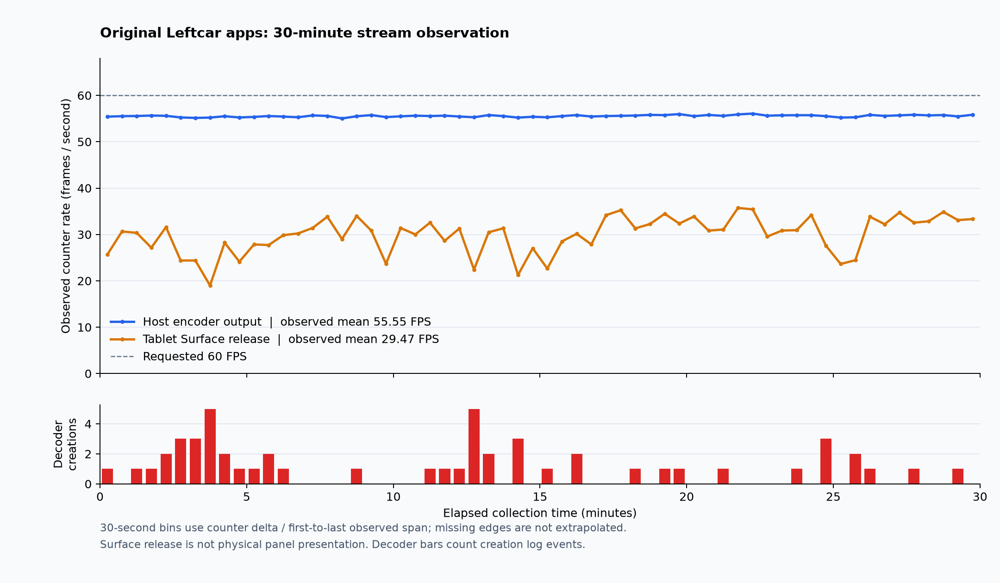

# 2026-09-14 원래 Leftcar 앱의 스트림 수정과 실기기 검사

이 기록은 사용자 승인 후 원래 앱으로 전환한 후속 검사다. [이전 준비 기록](2026-09-14-completion-followup-validation.md)의 승인 대기·미설치·시험용 앱 계획은 당시 상태이며 현재 실행 방식을 설명하지 않는다. 사용자는 상세 검증 문서의 공개 GitHub 게시와 기존 실제 DP 화면의 TB710FU 공유를 승인했고, 원래 앱과 ADB 사용을 지정했다.

## 실행 방식

- macOS는 `/Applications/Leftcar Host.app`, Android는 `leftcar.ll3.kr`을 사용한다. 별도 benchmark 앱 식별자·상태 경로를 사용하지 않는다.
- macOS는 기존 Apple Development 서명과 designated requirement를 유지하며 정상 앱 종료 후 같은 경로를 업데이트한다. Android는 기존 인증서와 패키지로 `adb install -r` 업데이트한다. 페어링 데이터·화면 승인·Viewer 설정을 지우지 않는다.
- Android UI 조작과 화면 확인은 ADB로 수행한다. ADB는 조작·관찰 경로이고 실제 미디어 전송은 협상된 LAN 경로로 별도 기록한다.
- SHA-256은 소스·설치 파일·로그의 동일성을 확인하는 기록이다. 앱 식별자나 권한을 바꾸는 수단으로 사용하지 않는다.
- 새 화면 생성 기능은 비활성 상태를 유지한다. 외부 도구로도 화면을 생성하지 않으며 기존 모드·해상도·배율·배치·활성 상태를 바꾸지 않는다.
- 기존 물리 DP 화면의 로컬 애니메이션 패턴을 공유한다. 시스템 오디오와 원격 입력은 OFF다. 다른 프로젝트의 Android 앱과 데이터를 보존한다.

## 실제로 발견한 문제와 수정

| 문제 | 결과와 검증 범위 |
| --- | --- |
| Swift 미디어 AEAD 바이트 순서 불일치 | Rust/JS와 같은 `counter / ciphertext / tag`로 정렬했다. 실제 Swift와 Rust를 양방향 실행하는 고정 벡터·변조·재전송 검사를 로컬/CI gate에 연결했다. |
| Native launcher의 메서드가 객체 전개에서 누락 | TurboModule의 prototype/lazy 메서드와 receiver를 보존하는 명시적 위임으로 바꿨다. 관련 JS 회귀 검사와 타입 검사, React Doctor 100/100을 통과했다. |
| 준비 단계 인증 후 연결 완료 상태 누락 | 원래 앱에서 LCH1 인증·echo까지 성공한 뒤 IDR 요청과 피드백이 억제돼 약 6초 후 Host가 종료하는 것을 재현했다. 인증된 challenge가 renderer에 공유되는 연결 완료 상태를 설정하도록 수정했다. |
| 준비 단계가 일반 미디어의 replay counter를 소비 | challenge 분류는 인증만 수행하고 일반 미디어는 renderer에 남긴다. 활성 single/split과 준비·일시 정지 경로가 challenge 기록을 공유해 이미 처리한 challenge가 replay window를 초기화하지 않도록 했다. |
| 전용 제어 소켓의 암호문을 그대로 파싱 | 같은 미디어 crypto로 인증·replay 검사를 통과한 뒤 LCP2/ACK를 처리한다. 두 소켓 간 중복·변조·평문·잘린 패킷 거부와 실제 UDP 응답 회귀 4건을 확인했다. |
| Host 시스템 오디오가 최초부터 ON | 새 viewer는 명시적 SNDON 전까지 캡처하지 않는다. viewer별 소유권, ON/OFF, 마지막 세션 종료 후 초기화 회귀 검사를 통과했다. |
| 소켓 종료를 요청 크기 초과로 표시 | IO 오류와 실제 줄 상한 초과를 구분한다. 연결 reset 재현과 기존 상한 차단 검사를 유지했다. |
| CI 오디오 대기 테스트의 시간 의존 | 실제 대기 진입을 동기화해 생산 코드의 timeout을 바꾸지 않고 CI의 간헐 실패를 수정했다. |

첫 수정 후보의 실제 영상 검사는 실패했다. 이 실패를 단위 검사·빌드 성공으로 덮거나 30분 수락으로 계산하지 않는다. 실패 로그와 당시 소스·Host/APK는 별도 보관하며 후속 후보로 덮어쓰지 않는다.

최종 native 수정은 Android 라이브러리 **258/258**, Android 대상 컴파일과 Clippy를 통과했다. 독립 읽기 검토에서 발견한 active→suspend replay 경계를 수정하고 두 진입 API의 RED→GREEN을 확인했다. 마지막 독립 검토의 미해결 P0/P1/P2는 0이며, 실기기 수락과 구분한다.

통합 후 전체 Rust gate도 종료 0이다: workspace **425개**(기존 수동 검사 1개 ignored), Host **257 + 12개**, fmt·Clippy·구조 검사, Swift shim/기존 adapter 컴파일과 순수 split/RTX/오디오 정책·Swift↔Rust 암호화 상호운용 실행이 통과했다. 검사 전후 **896개 build input**, SHA-256 `465cbd2fa66fcb278872d5864f29f5fa8b4817c16c6fc5d9d84cbe6ca422f2a3`가 일치한다. React 변경은 앞서 JS **615개**·contract **4개**·타입/브라우저 검사·React Doctor **100/100**을 통과했고, 그 뒤 React 소스 변경은 없다. 수정된 검증 도구의 관련 검사 **8개**도 통과했다.

## 현재 실기기 수락 상태

**실제 1800초 수집을 완료했지만 60fps 성능 수락은 실패했다.** Host 수집 경계는 2026-09-14 **13:42:39.941–14:12:39.864 KST**, monotonic 경과는 **1,800,000.166542ms**다. Host wall 경계 차이 1,799,923ms와 device wall 차이 1,800,055.490ms는 원래 clock bracket과 함께 보존한다. 60초 준비 구간과 아래 세 번의 시작/종료·패키지 생성·앱 설정·패턴 표시 시간은 포함하지 않는다.

Host PID 76871과 Viewer PID 14228의 시작·종료 식별자가 같고, interruption=false, collector error 0건이다. 두 수집 하위 프로세스는 도구가 소유한 정상 SIGTERM으로 종료됐다. 이것은 수집 완료와 앱 프로세스 유지의 증거이며 매끄러운 출력이나 실제 패널 표시를 증명하지 않는다.

| 30분 구간의 관측 | 결과 |
| --- | --- |
| Host encoder-output | 1,152개 표본, 관측 구간 1,798.922초, 평균 **55.5466fps** |
| Viewer Surface-release | canonical 1,748개 표본, 관측 구간 1,799.197초, 평균 **29.4720fps** |
| 최대 표본 간격 | Host 2,008ms / Viewer **14,446ms**. 공백 전체를 실제 0fps로 단정하지 않지만 연속 출력 수락의 근거가 부족하다. |
| 실제 decoder 생성 | `Creating H264 AndroidDecoder`와 성공 로그 **53쌍**. decoderEpoch 값 자체를 생성 횟수로 사용하지 않았다. |
| Host encoder watchdog | restart / termination / late callback 모두 0 |
| 앱 AU gap 분류 | networkLoss 1,233건 / recoverySkip 1,262건. RF 패킷 손실의 직접 측정이 아니며 두 분류를 같은 손실로 합산하지 않는다. |
| 캡처 시각→최근 release 시각 표본 | 1,739개, 중앙값 45ms, 범위 0–1,046ms. 추정 Host wall offset을 이용한 일부 release 표본이며 광학 지연이 아니다. |

그래프의 각 점은 30초 묶음 안에서 실제 관측한 첫·마지막 counter 차이를 그 사이 시간으로 나눈 값이다. 누락된 경계까지 외삽하지 않는다. 빨간 막대는 해당 구간의 decoder 생성 로그 수다.

자원 표본은 1,609개다. Host RSS는 116,784→116,304KiB(범위 116,048–117,008), Viewer RSS는 243,832→249,168KiB(범위 236,820–272,892)다. 이 표본만으로 누수 부재를 증명하지 않는다. current-HAL battery는 33.7→34.7°C, skin 최대 38.22°C, CPU 센서 최대 48.5°C이며 system thermal status는 관측 내내 0이었다. 시스템 센서 값을 앱만의 발열로 해석하지 않는다. 전원에 연결된 배터리 100% 상태라 소비전력·배터리 사용 시간은 미측정이다.

| 실제 반복 검사 | 관측 |
| --- | --- |
| 1회 | 13:32:46 시작 → 13:33:57 Viewer 종료. Surface-release 30→2370, 관측 delta 평균 33.60fps |
| 2회 | 13:35:57 시작 → 13:37:04 Viewer 종료. Surface-release 30→2310, 관측 delta 평균 35.27fps |
| 3회 | 13:37:10 시작 → 13:38:52 Viewer 종료. Surface-release 30→3450, 관측 delta 평균 33.82fps |

세 번 모두 실제 패턴 화면과 출력 증가·Viewer 종료 후 idle 목록 복귀를 확인했다. Host counter가 정지한 시점과 늦게 출력된 stop 로그는 구분한다. 세 번째 짧은 세션의 stop 로그는 최종 종료 시점인 14:14:06에야 남았다. stop 로그 지연 전체를 지속 캡처로 해석하거나, UI 종료만으로 모든 자원이 즉시 해제됐다고 주장하지 않는다. 60fps 성능 수락으로 계산하지 않는다.

최종 연속 스트림은 13:38:58에 열었고 이후 준비 구간을 거쳤다. 60초 준비 수집의 실제 monotonic 경과는 60,001.680ms, Host encoder 평균 55.667fps, Viewer Surface-release 평균 32.424fps였다. 기존 분석기는 동시에 출력된 legacy 행을 별도 unknown stream으로 집계하고, Host의 2초 로그와 Viewer의 30-frame 단위 로그 간격을 0fps stall로 취급해 invalid로 판정했다. 원본과 당시 판정은 보존하며 실제 정지와 관측 공백을 구분하는 분석을 별도로 검토한다.

수집 후 실제 패턴 화면을 ADB로 기록하고 14:14:05.932에 Viewer의 X 버튼으로 정상 종료했다. idle 화면 목록과 1440p 선택 보존, Host 최종 세션의 14:14:18.448 stop 로그를 확인했다. 시험 패턴 탭과 로컬 서버는 정리했고 원래 앱은 설치된 상태로 유지한다. 읽기 전용 화면 확인에서 DP의 3840×2160@60, 논리 1920×1080, 배율 2와 위치가 검사 전후 일치했다. sandbox 안의 첫 화면 조회가 빈 목록을 반환한 기록도 보존하고, 정상 앱 환경에서 다시 읽은 실제 목록으로 비교했다.

원본 `steady1800.collection.json` SHA-256은 `cb53a849189092eaf79dfaae3b6a87221948c5f19eee8ed9e21996c01d4f0891`이다. Host raw는 `c04173173a439b102e8c3d2ec1697cee49aa770c4b005a92681a48a3d11632a8`, Android raw는 `55b7384309fecaeab6b66f8fc94d33f11be2fee81dbf3ab35428b59e5b537b0e`다. 원본 invalid 판정과 파일을 덮어쓰지 않는다. Surface-release는 실제 패널 표시나 광학 입력 지연의 측정이 아니다.

## 분석기 교정과 재분석

수집 종료 후 별도 분석기 commit `76ccebf6a7a480728031a343f3be1a0441daf38b`에서 로그 해석을 수정했다. 설치 앱은 계속 `cc52614` 후보이며 분석 도구 변경을 앱의 새 실기기 검증으로 사용하지 않는다.

- 같은 PID/TID의 연속 canonical/legacy 행과 decoderEpoch별 counter 차이를 검증해 동시 출력을 연결한다. legacy 원문·행 번호·counter를 companion으로 보존한다. 원본에서 별도 unknown으로 나뉜 40개 legacy 계열 대신 canonical 1개 계열과 1,748개 companion이 남았다.
- 실제 같은 counter가 관측된 구간과 로그가 없는 구간을 구분한다. 로그 공백을 가상의 0fps 표본으로 p5에 넣지 않는다. 손상·미지원·단독 legacy, 잘못된 PID나 역행 timestamp는 계속 invalid다.
- 기존 1,500ms 관측 완전성 기준과 성능·수집 시간 기준은 완화하지 않았다. Host 648개, Viewer 229개의 긴 관측 간격이 남아 observationComplete=false다. zero-FPS 미검출은 무정지 증명이 아니다.

교정된 1초 표본 쌍의 p5는 Host 53.8385fps(503개 window), Viewer 26.7857fps(648개 window)다. 관측 가능한 window만의 값이며, 전체 기간의 연속성을 보장하지 않는다. 전체 평균은 **55.5466 / 29.4720fps로 변하지 않았고 collection invalid와 60fps 미충족 판정도 유지**한다.

검사 코드만 먼저 적용했을 때 97개 중 25개가 실패했고, 구현 적용 후 관련 97개가 모두 통과했다. 전체 타입 검사도 통과했다. 독립 검토에서 찾은 canonical 단독 행 검증과 timestamp 역행 문제를 수정한 최종 패치·파일 해시를 검증했다. 기존 준비/30분 raw와 receipt 6개 파일의 해시는 전후 같다. 별도 최종 재분석 receipt SHA-256은 `af147a95f0c97f7ec6761f1e5d2a3e547ead37ccee9083f26f7b697b3e21c9ee`다.

[기계 판독용 공개 결과](superpowers/evidence/2026-09-14-original-app-steady1800.json)에 앱 후보·분석기 버전·원본 해시·재분석·자원 관측을 연결했다.

## 설치한 후보와 전달 파일

깨끗한 후보 commit은 `cc52614a8fc519f723b7958976af5bc18a70a0eb`다. Host와 Android manifest는 동일한 896개 입력 digest `465cbd2fa66fcb278872d5864f29f5fa8b4817c16c6fc5d9d84cbe6ca422f2a3`에 연결됐다. source JSON 파일 자체의 SHA-256 `10e833f80616be37300d1af33472ad1a93ef6d22a8ee927eb3dd476e855e557b`는 내부 입력 digest와 별개이며 수집 도구가 두 값을 검증한다.

| 산출물 | SHA-256과 경계 |
| --- | --- |
| 설치한 원래 Host 앱 | `b6c23fcfee1f459bac7327c8d6849b06fa960bed00ffcb96183ca9db570c5a5e`; 기존 Apple Development 서명·designated requirement 유지, 공증 없음 |
| Host ZIP | `12f47be65535cc92c369f91327c3af1dd828f5cc5684eb98daecffbee427f61e`; 압축 왕복 후 앱 digest와 strict codesign 확인 |
| 설치한 원래 Viewer APK와 전달 APK | `51bb0aec5f628d402d002ed6f1fec6f786a83bf2dc24b8611845ad6addcf24c1`; 기존 debug 인증서 `dd0f47dc0791450eac89ac2d304930d642ff32ad888a618a1992a6225f3b9655` 유지 |

전달 파일은 저장소 옆 `completion-followup-artifacts-20260914/delivery-cc52614/`에 보관했다. 파일명은 `Leftcar-Host-0.1.2-cc52614-macos-arm64.zip`, `Leftcar-Viewer-0.1.5-cc52614-android-arm64.apk`다. 원래 Host PID 76871과 Viewer PID 14228에서 검사를 시작했으며 설치 후 기존 페어링 자동 연결·화면 목록 승인·1440p 설정·시스템 소리 OFF 보존을 확인했다. 다른 프로젝트 앱 두 개의 APK 해시도 업데이트 전후 일치한다.

[새 후보 CI 34806019257](https://github.com/loopy-lim/leftcar/actions/runs/34806019257)은 `cc52614`에서 모든 실제 자동 검사와 Windows NSIS 빌드가 성공했다. Device evidence placeholder의 성공은 실기기 수락으로 해석하지 않는다.

## 공개 범위와 남은 경계

[공개 초안 PR #6](https://github.com/loopy-lim/leftcar/pull/6)에서 코드와 검증 문서를 제공한다. 원래 앱 업데이트 및 내부 서명 검증은 생산용 배포 서명·공증이나 공개 릴리스 완료를 뜻하지 않는다.

기존 의존성 조사에서 남은 Bun advisory 4건, Commons IO advisory 2건과 API 24/25 호환성 수락, Gradle lock/신뢰 정책·상시 scanner, NOTICE/라이선스 정책, 생산 서명·공증은 별도다. 물리 입력·오디오·USB·Galaxy XR·Windows와 60분 lifecycle 검사는 이번 단일 화면 30분 검사로 충족되지 않는다. 화면 생성 실험은 수행 대상에서 제외한다.

이번 검사로 추가 확인된 우선 과제는 낮은 출력과 반복 decoder 복구, 시간 기반 관측의 부족, terminal native 세션의 정리 지연이다. decoder 재생성은 render-health 복구와 네트워크 AU 복구 대기가 겹치는 경로가 유력하지만 각 reset의 원인 로그가 없어 개별 원인은 확정하지 않는다. reset/flush 이유와 실제 decoder 공급·release 시각을 분리해 다음 수정의 근거로 삼아야 한다.

종료 경로에서는 BYE가 출력 상태·socket·오디오 encoder를 먼저 막지만 native registry의 강한 참조를 직접 제거하지 않는다. 별도 FFI 정리 때 늦은 stop 로그와 오디오 소유권 이전이 발생한다. terminal 보관 5초 만료도 후속 status snapshot 호출 때 검사하므로, 숨겨진 UI·호출 공백과 무관한 정리가 필요하다. 이 경로는 전원 assertion·일부 저장소나 오디오 owner 후보의 추가 보존 가능성을 남긴다. 실제 OS capture 종료 완료·최종 deinit 시각은 미측정이며, 이번 오디오는 계속 OFF였다. 이 생명주기 과제와 성능 과제를 해결하기 전 생산 릴리스 완료로 표시하지 않는다.
